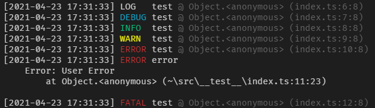

# node-trailer

A logger construct by functions.



## Featrues

- Use built-in or custom functions to customize what your logger show and how they show;
    - Customize theme;
    - Customize where log will be send.

## Install

    npm i -P node-trailer

## Useage

Use [default options](https://github.com/plylrnsdy/node-trailer/blob/master/src/defaultOptions.ts), it will output to `console`.

```javascript
const trailer = require('node-trailer');

let logger = trailer.create();
logger.log('log message');
```

## API

### trailer.create(`options`): [Trailer](#interface-Trailer)

#### options.`levels`: string[]

Set your logger's levels.

```javascript
let logger = trailer.create({
    levels: ['debug', 'info', 'warn', 'error']
});

logger.debug('log message');
logger.info('log message');
logger.warn('log message');
logger.error('log message');
```

#### options.`accepters`: Array<(level: string, args: any[]) => Output>

Genrate the `output`, if `level` and `args`(e.g. in `logger.log(...args: any[])`, `level = 'log'` and `args = args`) satisfy specific conditions.
If return an `output`, it will stop executing other functions.

#### options.`handlers`: Array<(output: Output) => void>

Transform the data in `output`, finally format the data into `Output#output` or `Output#colorOutput`.

#### options.`appenders`: Array<(output: Output) => void>

Get formated output and send to `console`, `colorConsole`, or `file`.

#### interface Trailer

Method: Trailer#`[level: string]: (...args: any[]) => void`

Example: Trailer#`log: (...args: any[]) => void`

### trailer.accepters

Built-in `accepter`.

- `useErrorInFirstArg(level: string, args: any[])`: Use first args as `Output#error` as source of `stack`, if it is instance of `Error`.
- `common(level: string, args: any[])`: Use build-in error as `Output#error` as source of `stack`.

#### class Output

- timestamp: number
- level: string
- template: string
- args: any[]
- message: string
- error: Error
- method?: string
- path?: string
- file?: string
- line?: string
- pos?: string
- style: { [color: string]: string }

### trailer.handlers

Built-in `handler`.

- date
    - `format(template: string)`
        - template
- level
    - `upper`: A handler for converting Output#`level` to upper.
    - `padEnd(width: number)`: Return a handler to ensure Output#`level` min-length equaling to `width`, if less than `width`, filling with whitespace.
        - width
- message
    - `format`: A handler for generating Output#`message` with printf-like template.
- stack
    - `filterTop(level: number)`: Return a handler to remove Output#`error.stack` row 1 ~ `level`, row 1 is `Error: <error.message>`.
        - level
    - `simplifyRoot(root: string, replacement: string = '~')`: Return a handler to replace the path `root` in `stack` with `replacement`.
        - root
        - replacement
    - `extract(featrue: RegExp = /at .+/)`: Return a handler to extract Output#`method`, Output#`path`, Output#`file`, Output#`line` and Output#`pos` from stack matched `featrue` first.
        - featrue
    - `filterThirdPart`: A handler for removing the row contain `node_modules` in stack.
    - `filterNative`: A handler for removing the row contain `internal` in stack.
- output
    - `format(template: string)`: Return a handler to format `output` data with `template` and save in Output#`output`.
        - template:
            1. `{{error.message}}` will fill with the content of Output#`error.message`.
            2. Can contain `{{style.xxx}}`, but it will be ignore.
- colorOutput
    - `format(template: string)`: Return a handler to format `output` data with `template` and save in Output#`colorOutput`.
        - template
            1. `{{error.message}}` will fill with the content of Output#`error.message`
            2. `{{style.red}}` will fill with the content of Output#`style.red`, after this string will show color as red in console.

### trailer.appenders

Built-in `appender`.

- `console(output: Output)`: Transport Output#`output` to console.
- `colorConsole(output: Output)`: Transport Output#`colorOutput` to console.
- `file(path: string)`: Retrun an appender to transport Output#`output` to file.

## Contribution

Submit the [issues][issues] if you find any bug or have any suggestion.

Or fork the [repo][repository] and submit pull requests.

## About

Author：plylrnsdy

Github：[node-trailer][repository]


[issues]:https://github.com/plylrnsdy/node-trailer/issues
[repository]:https://github.com/plylrnsdy/node-trailer

